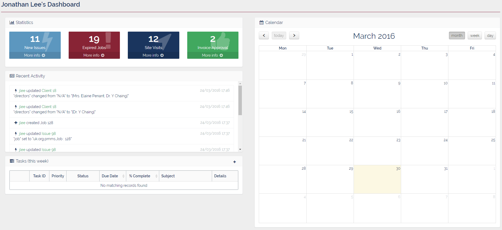

#User Dashboard
___
The User Dashboard displays a snapshot view of important information, relevant to the user who has logged in.  

___

##Measures
The dashboard is divided into several panels each of which contains a different summary of information.  

####&fa-bar-chart; Statistics
This panel displays data about the number of new issues, expired jobs, site visits, and invoices awaiting approval, assigned to the currently logged in user.  
Each metric is displayed in it's own colour-coded box, with relevant icon, along with a **More Info &fa-arrow-circle-right;** link which will load (and automatically filter) the appropriate list screen (i.e. [Issue List](../Maintenance/Issue#issue-list), [Job List](../Maintenance/Job#jobs-list), or [Site Visit List](../Maintenance/SiteVisit)).  

####&fa-newspaper-o; Recent Activity
This panel displays the 10 most recent actions of the currently logged in user. These actions can include: creation of new Issues/Jobs, updates made to existing Issues/Jobs, addition of Notes to an Issue/Job.

####&fa-tasks; Tasks (this week)
This panel displays the list of tasks assigned to the currently logged in user which are due for completion in the current week. This tasks can range from booking meeting venues to sending out AGM papers, but can also include tasks from within a task-list associated to a project.  

For each task in the list the following information is displayed: Task ID, Priority, Status, Due Date, Percentage Completion, Title, and Details of the task. There is also a &fa-eye; View button which will open the task.

####&fa-calendar; Calendar
This calendar view shows any client meetings, for clients in the current users portfolio, or approved site visits due within the current month. The calendar view is set to "Month" by default, but can be changed to "Week" or "Day" view using the buttons in the upper-right of the panel, and months, weeks, or days can be moved through using the arrow buttons in the upper-left of the panel.
