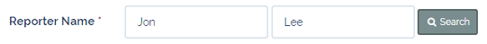

# Issues
___
Issues are the means of recording and monitoring problems or faults reported by property owners and/or contractors whilst working on site (which will likely result in a Job being raised).  

Issues can also be requests for information relating to a particular Property or Client; e.g. access codes (gates/ barriers/ bin stores/ bike sheds), buildings insurance information, parking permit / parking control inquiries.

____
##Fields
  Issues consist of the following fields:

  | Field | Required | Description |
  | --- |:---:| --- |
  | Client Name  | &fa-check;  | The client to which the Issue relates |
  | Reporter Name |  &fa-check; |  The first and last name of the person reporting the Issue.  *(A search can be performed by entering first / last / or both names and clicking the &fa-search Search button)* |
   | Reporter Phone | &fa-times; |  The contact phone number of the person reporting the Issue. *(This number will be used if access is required to a particular property.)* |
  | Reporter Email | &fa-check; |  The email address of the person reporting the Issue.|
  |Property | &fa-times; | The property to which the issue relates. *(NOTE: Only if the Issue relates to a specific property, owned by the person reporting the Issue.)* |
  |Issue Description| &fa-check;| A clear and concise description of the Issue with as much information as possible. *(Maximum 300 characters)*
  |Issue Title| &fa-check; | A summary title for the Issue.|
  |Assigned To| &fa-times; | The PMMS staff member who will initially be responsible for assessing the Issue, prior to further action. |  

___

## Issue List
The Issue List is a list of all the Jobs currently held in the PMMS system. It can be accessed from the top menu bar under the "Maintenance" drop-down category. The list can then be filtered and sorted to show only the required sub-set of Issues.  

  

___

## Issue Filters
The Issue list can be filtered by using the collapsible filter panel, which can be opened by clicking <button class="btn btn-xs btn-primary"><i class="fa fa-fw fa-caret-down"></i> Filters</button>

Once the filter panel is open the filters can be applied or reset using the appropriate buttons and all closed Issues can be hidden/shown by clicking the toggle switch 

Multiple filters can be applied simultaneously by entering values into the appropriate fields and clicking  <button class="btn btn-xs btn-info"><i class="fa fa-fw fa-filter"></i> Apply Filter</button>

All filter values can also be reset by clicking <button class="btn btn-xs btn-danger"><i class="fa fa-fw fa-times"></i> Clear Filter</button>

The Job filters panel contains the following filters:

| Field | Description |
|---|---|
|Issue ID | If the required Issue ID is known it can be entered here to show only that Job.|
|Client ID | This is a drop-down list of 2, 3, or 4 character Client IDs. Only 1 client can be selected at a time.|
|Status | This multi-select drop-down shows the list of all the possible Job status values. Multiple statuses can be selected by clicking the checkbox in the dropdown list. You may also select / deselect all statuses using the "Select All" checkbox at the top of the list.|
| Assigned To | This enables Issues to be filtered by the PMMS staff member to which they are currently assigned. This is useful for determining "how many Issues does X have?"|
| Reporter Name|This is a text box which performs a "like" search for the value entered. This is not a "keyword" search as it will not search for individual terms entered (i.e. "John Doe" will not search for "John" and "Doe" as separate terms, only for the full text "John Doe"). This filter is not case sensitive.|
| Issue Title | This is a text box which performs a "like" search for the value entered (similar to the Reporter Name filter above). This filter is not case sensitive.|
| Job ID | If the issue has been linked to a Job then the ID of the Job can be filtered here. You may only enter one Job ID at a time (i.e. you can not filter for a number range).|
| Min/Max (days) Age & Last updated | These two filters operate in a similar way. They enable Issues to be filtered either less than a certain number of days (Max box), or greater than a certain number of days (Min box), or between two values (Max and Min box). This is useful for determining Issues created, or updated, today or in the last 7,30,60,90 or 7,14,30 days (respectively).|

___

## Add a New Issue
 1.   Select <i class="fa fa-fw fa-plus text-success"></i><i class="fa fa-fw fa-bolt text-success"></i> **New Issue** from the Maintenance menu.
 2. The **Create New Issue** form is then shown.  
 

 1. Select a Client from the list of options, then enter either the first or last name (or both) of the reporter and click &fa-search; Search  
   

 2.  If any search results are found they will be displayed in the right-hand panel **Search Results**  
  

 3. Select the required Contact from the list by clicking the <button class="btn btn-xs btn-default"><i class="fa fa-fw fa-chevron-left"></i> Select</button> button, or if the required Contact is not shown then complete the **Reporter Phone** and **Reporter Email** fields manually.  

 4. If the Issue relates to a specific property, owned by the Issue reporter, then select it from the **Property** drop-down list.  

 5. Enter **Issue Description**, **Issue Title**, and (optionally) **Assigned To**.  

 3. Once all of the required fields have been completed, click <button class="btn btn-xs btn-success"><i class="fa fa-fw fa-save"></i> Save</button>

!!! info "&fa-send; Notifications"
    When an Issue is saved it triggers the sending of 2 notifications. One is sent to the Issue Reporter (assuming that an email address was entered) with details of the information entered, and the other to the PMMS staff member the Issue was assigned to (assuming that **Assigned To** was specified).

Once an Issue has been raised it may be necessary to [Raise a Job](../Maintenance/Job#raise-a-new-job) or [Link Existing Job](../Maintenance/Job#link-existing-job)
___
## Edit Existing Issue
Once a job has been created it can be edited for one of the following reasons:

- The fault details are incorrect / require further information
- The fault location is incorrect / not specific enough
- The Nominal Code is incorrect
- The Job needs to be re-prioritised (i.e. increase / decrease priority)
- The Job needs to be re-assigned to another PMMS staff member
- The Job requires a Site Visit.

### Edit a Job
  1. Open the required Job and click on the "Edit" button  
    

  1. The "Edit Job XX" form is then displayed  
    

  1. Once all of the necessary fields have been updated, click the "Update" button.  
