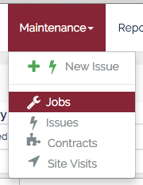
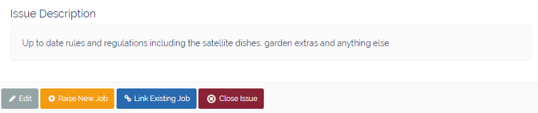
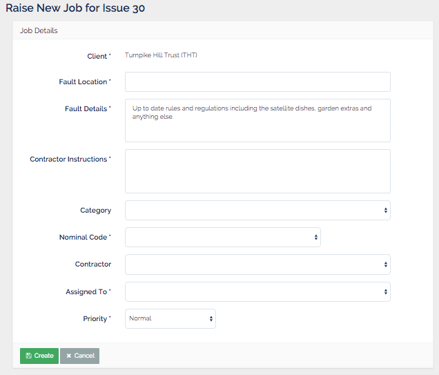
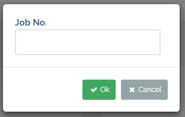
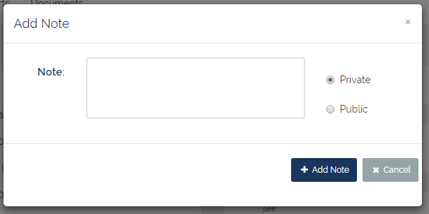

# Jobs
___
Jobs are the means of instructing and tracking the progress of works or tasks performed by third party suppliers (Contractors). This work can include, but is not limited to: affecting repairs, removing bulk items, or providing quotes for proposed works.

!!! danger "&fa-exclamation; Please Note"
    Any Issues which **do not** require the services of a Contractor should **not** be raised as Jobs.

____
##Fields
  Jobs consist of the following fields:

  | Field | Required | Description |
  | ------------ |:-------------:| ------------ |
  | Client  | &fa-check;  | The client to which the job relates |
  | Fault Location |  &fa-check; |  This is where the required works are to be carried out. This should include as much information as possible about the location of fault (e.g. "Binstore B4" or "Inside Flat X") |
  | Fault Details | &fa-check; | This is the description of the fault. This is pre-populated from the source Issue, but should be updated with any relevant information from the Issue Notes.|
  |Contractor Instructions | &fa-check; | This is a concise work instruction to the contractor, but should contain as much information as possible (including contact details of property owners should access to a property be required.)|
  |Nominal Code| &fa-check;| This is the Client nominal code that determines which budget heading the works will be carried out under. This is used when invoices are attached to the Job.|
  |Category| &fa-times; | The category of the works required. Selecting a category will filter the list of available contractors to those who are authorised to carry out the works required for the given client.|
  |Assigned To| &fa-check; | This is the PMMS staff member who will be responsible for managing the works to completion (this will usually be a maintenance co-ordinator).  |
  |Priority| &fa-check;| This is the timeframe in which the works should be completed. It can be either "Low" (10 days), "Normal" (5 days), "High" (3 days), or "Emergency" (24 hrs).  |

___

## Jobs List
The Job List is a list of all the Jobs currently held in the PMMS system. It can be accessed from the top menu bar under the "Maintenance" drop-down category. The list can then be filtered and sorted to show only the required sub-set of Jobs.  

  

___

## Job Filters
The Job list can be filtered by using the collapsible filter panel, which can be opened by clicking <button class="btn btn-xs btn-primary"><i class="fa fa-fw fa-caret-down"></i> Filters</button>

Once the filter panel is open the filters can be applied or reset using the appropriate buttons and all closed Jobs can be hidden/shown by clicking the toggle switch 

Multiple filters can be applied simultaneously by entering values into the appropriate fields and clicking  <button class="btn btn-xs btn-info"><i class="fa fa-fw fa-filter"></i> Apply Filter</button>

All filter values can also be reset by clicking <button class="btn btn-xs btn-danger"><i class="fa fa-fw fa-times"></i> Clear Filter</button>

The Job filters panel contains the following filters:

#### Job ID
If the required Job ID is known it can be entered here to show only that Job.

#### Client ID
This is a drop-down list of 2, 3, or 4 character Client IDs. Only 1 client can be selected at a time.

#### Status
This multi-select drop-down shows the list of all the possible Job status values. Multiple statuses can be selected by clicking the checkbox in the dropdown list. You may also select / deselect all statuses using the "Select All" checkbox at the top of the list.

#### Category
This is also a multi-select drop-down and it shows the list of available Job categories. Multiple categories can be selected by clicking the checkbox in the dropdown list. You may also select / deselect all categories using the "Select All" checkbox at the top of the list.

#### Fault Details
This is a text box which performs a "like" search for the value entered. This is not a "keyword" search as it will not search for individual terms entered (i.e. "Broken Window" will not search for "Broken" and "Window" as separate terms, only for the full text "Broken Window"). This filter is not case sensitive.

#### Contractor
Like the Fault Details filter this is a text box which performs a "like" search rather than a "keyword" search. It is also not case sensitive.

#### Assigned To
This enables Jobs to be filtered by the PMMS staff member to which they are currently assigned. This is useful for determining "how many Jobs does X have?"

#### Min/Max (days) Age & Last updated
These two filters operate in a similar way. They enable Jobs to be filtered either less than a certain number of days (Max box), or greater than a certain number of days (Min box), or between two values (Max and Min box). This is useful for determining Jobs created, or updated, today or in the last 7,14,30 days.

#### Priority
This drop-down filter allows only those Jobs with a certain priority to be displayed. Only 1 priority can be selected at a time.
___

## Raise a new Job
In order to add a new Job to the system an Issue must first be created. Once the Issue has been created a Job can be raised for the Issue by:

 1. Open the Issue which requires a Job to be raised, and click <button class="btn btn-xs btn-warning"><i class="fa fa-fw fa-arrow-circle-up"></i> Raise New Job</button>
 

 2. The **Raise New Job for Issue** form is then shown alongside the details and notes of the Issue.  
 

 3. Once all of the required fields have been completed, click &fa-save; Create

!!! info "&fa-send; Notifications"
    When a Job is saved it triggers the sending of 2 notifications. One is sent to the allocated Contractor, inviting them to accept the Job allocated to them, and the other to the PMMS staff member the Job was assigned to.
___
## Link/Unlink Existing Job
If an Issue has been created which requires a Job to be raised, but a Job already exists for a similar Issue (ie. the same fault reported by multiple property owners), it is not necessary to raise a new Job for each Issue - an Issue can be linked to an existing Job
####Link a Issue and Job
1. Open the Issue to be linked to the existing Job and click &fa-link; Link Existing Job
2. Enter the Job ID into the pop-up from that appears.  
  
**NOTE: If the Job ID to be linked is unknown, then perform a Job Search in another browser window using the [Job Filters](#job-filters)**
3. Click &fa-check; Ok
4. The Issue details should now show the Job ID previously entered into the pop-up.

####Unlink an Issue and Job
If an Issue is mistakenly linked to the wrong Job, it can be unlinked.

1. Open the incorrectly linked Job
2. Select the **Issues** tab in the **&fa-th; Additional Info** panel
3. Find the incorrectly linked Issue and click &fa-unlink; Unlink
4. The Issue should no longer appear in the **Issues** tab, and the **Job ID** in the Issue details should be blank.

___

## Edit Existing Job
Once a job has been created it can be edited for one of the following reasons:

- The fault details are incorrect / require further information
- The fault location is incorrect / not specific enough
- The Nominal Code is incorrect
- The Job needs to be re-prioritised (i.e. increase / decrease priority)
- The Job needs to be re-assigned to another PMMS staff member
- The Job requires a Site Visit.

To edit an existing Job:

  1. Open the required Job and click <button class="btn btn-xs btn-default"><i class="fa fa-fw fa-pencil"></i> Edit</button>

  2. The **Edit Job** form is then displayed  
    

  3. Once all of the necessary fields have been updated click <button class="btn btn-xs btn-success"><i class="fa fa-fw fa-refresh"></i> Update</button>
___

## Job Notes
Once a Job has been raised notes containing additional information, or conversation between PMMS and the allocated contractor, can be added. There are two types of notes: Private and Public.

<dl class="note note-private center-block">
  <dt>Private Notes</dt>
  <dd>These are notes intended only for PMMS as their audience, and therefore can not be seen by anyone other than PMMS users. Private notes can be identified by their grey background.</dd>
</dl>
<dl class="note note-public center-block">
  <dt>Public Notes</dt>
  <dd>These are notes intended for both PMMS and external audiences, and therefore can be seen by both PMMS users and contractors. Public notes are indicated by either yellow (notes originating from PMMS users) or blue (notes originating from users outside PMMS) backgrounds.</dd>
</dl>

### Add a note
1. In the notes pane click <button class="btn btn-xs btn-default"><i class="fa fa-fw fa-plus"></i></button> to display the **Add Note** modal window.  

2. Select the required Note type (**Private** or **Public** - notes are always Private by default), then enter the body of the note.

3. When complete click <button class="btn btn-xs btn-primary"><i class="fa fa-fw fa-plus"></i> Add Note</button> The pop-up will close and the note will be displayed in the **Notes** pane

!!! danger "&fa-exclamation; Note"
    **Once created a Note can not be editted or moved.** Before saving please ensure that the information supplied is correct, there are no spelling errors, the Note is of the correct type, and that the Note is being added to the correct Job.

!!! info "&fa-send; Notifications"
    Once a Note is added to a Job an email notification is sent to the PMMS user to which the Job is assigned. If a **Public** Note is added an additional email notification is sent to the contractor, which will contain the information in the Note.
___
##Files

Files can be attached to a Job in the same way as other objects such as Issues, Clients, and Contracts.  
Further details about adding attachments can be found [here](../Common/Files)
