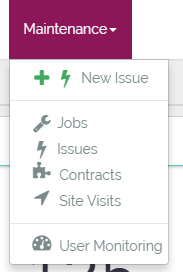
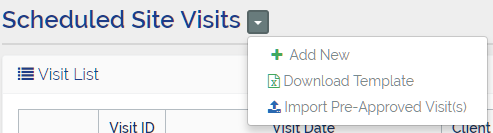
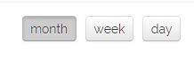
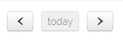

# Site Visits

Site Visits are the means of regularly checking a Client (Site) to ensure the contractors employed on that Site are providing a good standard of service. Site Visits are also for identifying maintenance issues which need to be resolved and for checking on any active project work on the Site.  

The majority of Site Visits are scheduled in advance but ad-hoc visits may also be required due to unforseen circumstances or at the specific request of a Client.
____

### Fields
Site Visits consist of the following fields:

Field  | Required  | Description
--|---|--
Client | &fa-check; | This is the 3-4 character shorthand designation for each client
Visit Start Date | &fa-check;  |  This the start date and time of the Site Visit
Visit End Date | &fa-check;  |  This the End date and time of the Site Visit
Details  | &fa-check;  | This is either the name of the Site Visit (for per-approved visits) or a description of the need for the Site Visit (for ad-hoc vists).
Jobs | &fa-times; | This is a list of Jobs, marked as "Requires Site Visit", which may form the basis for the purpose of the Site Visit.  

---
### Site Visit List
The Site Visit List is a list of all the Site Visits currently scheduled in the PMMS system. It can be accessed from the top menu bar under the "Maintenance" drop-down category. The list page consists of both a tabular and calendar view of the currently scheduled Site Visits.  

 

----
### Site Visit List Options
Once the Site Visit List screen has been opened there are a number of additional options that can be accessed via the drop-down menu 

#### <i class="fa fa-fw fa-plus text-success"></i> Add New
Selecting this option opens the Request Site Visit screen

#### <i class="fa fa-fw fa-file-excel-o text-success"></i> Download template
This option downloads the Excel template file necessary to import pre-approved Site Visit(s)

#### <i class="fa fa-fw fa-upload text-info"></i> Import Pre-approved Visits
This option opens an upload dialog for completed Site Visit import spreadsheets

---
### Site Visit Calendar
The Site Visit List screen includes a calendar view of the currently scheduled Site Visits. The calendar can be viewed by Month, Week, or Day by selecting the required view from the upper right-hand side:  

Also the period displayed on the calendar view may be changed using the Previous, Today, and Next butttons in the upper left-hand side:  

---
### Site Visit Details
The details of a specific Site Visit can be displayed by either: clicking the <button class="btn btn-xs btn-success"><i class="fa fa-fw fa-eye"></i> View</button> from the Site Visit List or by by clicking on the relevant calendar entry.

The Site Visit Details screen contains several panels which each have a title that describes its contents.

#### Site Visit Details
This panel contains the information that was entered when the Site Visit was created such as: Client, Details, and optionally a list of Jobs associated with the visit.

#### Issues
This panel is initially empty, but once the visit has been carried out any previously unknown maintenance problems can be entered here as Issues (which will automatically link themselves with the Site Visit so that they can easily be identified as the result of a Site Visit).  

Once an Issue has been raised from a Site Visit the Issue can be accessed by clicking on the grey Issue number button, and additionally any relevant files or documents can be attached to the Issue by clicking <button class="btn btn-xs btn-success"><i class="fa fa-fw fa-upload"></i></button>  

#### Additional Info
This panel is very similar to other "Additional Info" panels found in other parts of the PMMS system. It contains 2 tabs: "Files" which allows photographs and other documents (e.g. scanned copies of hand written site visit notes) to be attached to the Site Visit, and "Activity" which displays a list of events from the Site Visit lifecycle.

---

### Add Site Vists
As previously mentioned a Site Visit can either be scheduled (pre-approved) or ad-hoc, and there is a different procedure for adding a Site Visit depending on its type.

#### Import Pre-Approved Visits
Pre-approved Site Visits are imported via a spreadsheet **by the PM responsible for conducting the Site Visit** as the import process will assign the Site Visits to the currently logged in user.  

To import a list of pre-approved visits:  

1. From the Site Visit Options drop-down menu select <i class="fa fa-fw fa-file-excel-o text-success"></i> Download Template  

2. Open the Excel template file and complete the relevant fields (please refer to the [Site Visit Fields](#fields) section to determine required/optional fields) for each Site Visit to be imported  

3. Save the file and from the Site Visit Options drop-down menu select <i class="fa fa-fw fa-upload text-info"></i> Import Pre-Approved Visit(s)  

4. Select the file saved previously and click <button class="btn btn-xs btn-info"><i class="fa fa-fw fa-upload"></i> Upload</button>  

5. Assuming that no errors have occurred then you will be returned to the Site Visit List screen once the import is complete.  

#### Request an Ad-hoc visit
Ad-hoc visits must be requested **and approved by an approver** via the PMMS system prior to being carried out as any ad-hoc visit will typically result in an additional charge to the Client.  

To request an ad-hoc visit:  

1. From the Site Visit Options drop-down menu select <i class="fa fa-fw fa-plus text-success"></i> Add New  

2. Complete the "Request Site Visit" form (please refer to the [Site Visit Fields](#fields) section to determine required/optional fields) and click <button class="btn btn-xs btn-success"><i class="fa fa-fw fa-save"></i> Create</button>  

3. Once the request has been created you will be directed to the Site Visit Details screen where the status of the Site Visit will be Draft until it is approved.

---

### Approving a Site Visit

---

### Completing a Site Visit
Once the Site Visit has been approved and the visit carried out, the results of the visit must be recorded against the Site Visit entry in the PMMS system before the visit can be completed. These results will consist of: photographs (with descriptions of what they contain and where they were taken), scanned copies of any hand-written notes or annotated site plans, and any previously unknown maintenance problems that can then be raised as Issues.  

#### Add Issues
To record a maintenance problem as an Issue (which is automatically linked to a Site Visit):  

1. Open the Site Visit Details screen of the relavant Site Visit and click <button class="btn btn-xs btn-success">Add Issue</button>  

2. In the dialog box enter a description of the Issue and click <button class="btn btn-xs btn-primary"><i class="fa fa-fw fa-save"></i> Create</button>  

3. The Issue panel will then display a table containing the Issue that was just created along with any other Issues created from this Site Visit.  

4. Issues can then be opened in another tab by middle-mouse-clicking the grey button or any relavant files added to the Issue by clicking <button class="btn btn-xs btn-success"><i class="fa fa-fw fa-upload"></i></button>  

#### Add Photographs / Documents
Photographs (or other supporting documents) may be added to the Site Visit "Files" tab in the "Additional Info" panel.

1. Open the "Files" tab in the "Additional Info" panel and click <button class="btn btn-xs btn-info"><i class="fa fa-fw fa-upload"></i> Upload</button>  

2. You may drag-and-drop mutiple files into the "Upload File" dialog box or click inside the box to display a traditional file-picker.  

3. Once all of the desired files have been uploaded click <button class="btn btn-xs btn-default"><i class="fa fa-fw fa-times"></i> Cancel</button> to close the "Upload File" dialog.

4. Refresh the browser window either with the refresh button or by pressing the **F5** key and the files will appear in the "Files" tab.  

5. A description of a file's contents (or for photographs a description of what the photograph shows and where it was taken) can be entered by clicking on *Empty* in the description field and entering a suitable value.  

Once all necessary Issues and Files have been added to the Site Visit the <button class="btn btn-xs btn-default"><i class="fa fa-fw fa-check"></i> Complete Visit</button> button can be clicked, which will set the Site Visit status to Complete  

---

### Generate Site Visit Report
Once a Site Visit has a status of Complete the <button class="btn btn-xs btn-info"><i class="fa fa-fw fa-line-chart"></i> Generate Report</button> button becomes visible. When this is clicked the PMMS system will produce a PMMS branded formatted report, containing all photographs and their descriptions, in PDF format which can then be attached to the Site Visit.