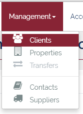

# Clients
___
Clients (or Sites) are the entities to which PMMS are responsible for providing property management services. Clients usually consist of a number of Properties (or Units) which each contribute towards the cost of the upkeep of any common parts which the Client is responsible for (e.g. interior hallways, stairwells, or exterior grounds).

## Fields
  Clients consist of the following fields:

Field  | Required  | Description
--|---|--
Name | &fa-check; | This is the legal registered name of the Client
ClientID  | &fa-check;  |  This is the 3-4 character shorthand designation for each client
Managed Properties  | &fa-check;  | This is the list of Properties which this client is responsible for, which may span multiple blocks, roads, or postcodes.
Registration No.  | &fa-times;  |  The registration number of the company, if it is registered with Companies House.
Registration Date  |  &fa-times; |  The date of the registration of the company with Companies House
Year Start  | &fa-check;  |  This the start of the current financial year for the Client
Year End  | &fa-check;  |  This is the end of the current financial year for the Client
Property Manager  | &fa-check;  | This is the Property Manager responsible for this Client

---
## Client List
The Client List is a list of all the Clients currently being managed by PMMS. It can be accessed from the top menu bar under the "Management" drop-down category. The list can then be filtered and sorted to show only the required sub-set of Clients.  

  

---
## Client Filters
The Client list can be filtered by using the collapsible filter panel, which can be opened by clicking <button class="btn btn-xs btn-primary"><i class="fa fa-fw fa-caret-down"></i> Filters</button>

Multiple filters can be applied simultaneously by entering values into the appropriate fields and clicking  <button class="btn btn-xs btn-info"><i class="fa fa-fw fa-filter"></i> Apply Filter</button>

All filter values can also be reset by clicking <button class="btn btn-xs btn-danger"><i class="fa fa-fw fa-times"></i> Clear Filter</button>

The Job filters panel contains the following filters:

Field  |  Description
--|--
Client ID  |  This allows the list to be filtered to a single Client reference code
Name  |  This is a free text search of the name field
Managed Properties  |  This is a free text search of the Managed Properties field
  Year Start|  This is a drop-down list of calendar months which allows all clients with a Year Start date within the selected month to be selected
Year End   |  This is a drop-down list of calendar months which allows all clients with a Year Start date within the selected month to be selected
PM  |  This is a drop-down list of maintenance department members which allows all clients managed by a particular Property Manager to be selected.

---
## Client Details
Once a client has been chosen from the Client List, the Cleint Details can be shown be clicking <button class="btn btn-xs btn-primary"><i class="fa fa-fw fa-eye"></i> View</button>

The Client Details screen contains several panels (each with a title that describes its contents), a number of statistics boxes (similar to the User Dashboard), and a tab menu at the upper right.

### Client Status
  

This area shows the total number of Open Jobs, Open Issues, New Issues, and (optionally) any Calendar Events coming up.

### Client Details
  

This panel shows information about the Client (such as Name, Managed Properties, Year Start, Year End, etc.) as well as a map showing the location of the first property associated with the Client.

### Files
  

This panel shows any files or documents which have been attached to this client. This can include: Copies of Leases, Insurance Documents, Site Plans, or any other documents relevant to the Client.

### Properties
  

This panel shows a list of the properties associated with the Client. The information displayed consists of Property ID, Address (Unit No, Address 1, and Post Code), Property Type, and the current Account No.

### Directors
  

This panel shows a list of the current Client Directors who are responsible for making decisions and approving expenditure on behalf of the Client.

### Contracts
  

This panel shows any current Contracts associated with the Client (i.e. Communal Cleaning, Grounds Maintenance, Lift Maintenance, Entry Phone Services, Fire Alarms, etc.) This panel is useful for determining not only which contractors supply regular services to the Client, but also how often and when is that service usually supplied.
