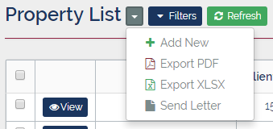

# Property
___
Properties (or Units) are the individual constituent parts that make up a Client, i.e. each Client consists of multiple Properties, and each Property has a type (e.g. 1 Bed Flat, House, Maisonette, etc). A Property represents a contributor towards the service charge and/or ground rent owed to the Client, which are usually only habitable spaces but in some cases can include non-habitable recreational / mixed-use spaces (e.g. gyms, garages, or other types of meeting space).

## Fields
  Properties consist of the following fields:

Field  | Required  | Description
--|---|--
Client | &fa-check; | The Client to which this Property belongs.
PropertyID | &fa-check; | This is the unique reference by which the Property is known, and is of the form: ```{ClientID (3/4)}-{Road (1/3}-{UnitNo (3/5)}```
Address  | &fa-check;  |  This is the physical location of the property (including the 3 digit ISO country code - 'gbr' for 'United Kingdom')
Property Type | &fa-times;  | This is the type of the property which can be one of the following: **Studio Flat**, **1 Bed Flat**, **2 Bed Flat**, **3 Bed Flat**, **House**, **Maisonette**, **Other**
Service Charge Type  | &fa-times;  |  The service charge category which indicates this property's contribution to the service charge.

---
## Property List
The Property List is a list of all the Properties currently being managed by PMMS. It can be accessed from the top menu bar under the "Management" drop-down category. The list can then be filtered and sorted to show only the required sub-set of Properties.  


## Property List Options
Once the Property List screen has been opened there are a number of additional options that can be accessed via the drop-down menu adjacent to <button class="btn btn-xs btn-primary"><i class="fa fa-fw fa-caret-down"></i> Filters</button>  



#### <i class="fa fa-fw fa-plus text-success"></i> Add New Property
This allows a new Property to be added to the existing Property list. Selecting this option opens the "Create Property" screen which can also be accessed from the drop-down menu of the "Properties" panel on the Client Details screen.

#### <i class="fa fa-fw fa-file-pdf-o text-danger"></i> Export PDF / <i class="fa fa-fw fa-file-excel-o text-success"></i> Export XLSX
This allows the details of a group of Properties to be exported to a formatted PDF/XSLX document, to be used for reporting purposes. The specific Properties required to appear in the output can be selected using the checkboxes adjacent to the <button class="btn btn-xs btn-primary"><i class="fa fa-fw fa-eye"></i> View</button>

#### <i class="fa fa-fw fa-file"></i> Send Letter (Under Development)
This allows mail-merge letters to be generated, from a pre-defined template, addressed to the selected list of Properties (which are selected using the checkboxes as above). This function is currently under development and should not be used.

---
## Property Filters
The Property list can be filtered by using the collapsible filter panel, which can be opened by clicking <button class="btn btn-xs btn-primary"><i class="fa fa-fw fa-caret-down"></i> Filters</button>

Multiple filters can be applied simultaneously by entering values into the appropriate fields and clicking  <button class="btn btn-xs btn-info"><i class="fa fa-fw fa-filter"></i> Apply Filter</button>

All filter values can also be reset by clicking <button class="btn btn-xs btn-danger"><i class="fa fa-fw fa-times"></i> Clear Filter</button>

The Property filters panel contains the following filters:

Field  |  Description
--|--
Property ID |  This allows the list to be filtered to a single Property reference code
Client ID  |  This is a drop-down list of clients which allows the list to be filtered to just Properties of a given Client
Address |  This is a free text search of the Address fields
  Owner|  This is a free-text search of the owners name(s) and account number.

---
## Property Details
Once a Property has been chosen from the Property List, the Property Details can be shown be clicking <button class="btn btn-xs btn-primary"><i class="fa fa-fw fa-eye"></i> View</button>

The Property Details screen contains several panels, each with a title that describes its contents.

#### Property Details
  
This panel contains relevant information about the property: Client name (and a link to that Client's detail page), Property ID, Address, and Property Type.

There is also a drop-down menu in this panel which provides an <span style="background: #efefef; padding: 4px;">&fa-pencil; Edit</span> option to edit the Property details.

#### Account information
  
This panel contains information about the current Owner Account associated with the Property. It displays the Account No. (in the panel title) and contact information for the owner(s) of the Property (i.e. name, phone number, email address, and address - if different to the Property address).

#### Recent Issues
  
This panel displays the most recent Issues associated with a Property including: the current status of the Issue, when the Issue was last updated, and also whether a Job has been raised against that Issue.

#### Finances
  
The Finances panel displays information about the service charge, for the current year (shown in the panel title), including the available payment plan options (specified in the service charge type).

#### Arrears
  
The arrears panel shows the current state of the service charge account for a given property (i.e. whether the property is in arrears and whether any arrears reminders have been sent). This panel also has a <button class="btn btn-xs btn-default"><i class="fa fa-fw fa-file"></i>Statement</button> button which shows an on-screen service charge statement that can then be printed or exported to PDF (for attaching to an email).

#### Files
  
This panel shows any files or documents which have been attached to this Property. This can include: correspondence received from the Property owner(s), completed "Management Particulars" forms, or any other documents relevant to the Property.

---
## Import Properties via Spreadsheet
Properties can be added to a Client individually (through the "Add Property" screen) or in bulk via a spreadsheet upload. In order to achieve this:  

1. Open the Client Details page for the required Client  

2. From the Properties panel select <span style="background: #efefef; padding: 4px;"><i class="fa fa-fw fa-file-excel-o text-success"></i> Download Template</span> from the drop-down menu  
3. Complete the Properties Sheet referring to the [Property Fields](#fields) table above for field values and types, and completing the property addresses including the ISO 3 digit country code ('gbr' for United Kingdom).  
4. Complete the Owners sheet with as much information about the property owners as possible i.e. address (including country code as above), phone number (phone types are: **MOBILE**, **WORK**, or **HOME**), and email (email types are: **PERSONAL** or **WORK**).  

    !!! danger "&fa-exclamation; Note"
        Each Property can have multiple owners who should be entered on a separate line - e.g. Mr T and Mrs J Smith should be entered on separate lines with the same Property Id and address, but with different contact email and phone numbers if provided.

5. Save the spreadsheet with a suitable name to a known location (e.g. "My Documents" or "Desktop")  

6. From the Properties panel of the Client Details page select <span style="background: #efefef; padding: 4px;"><i class="fa fa-fw fa-upload text-info"></i> Import Properties</span>, and in the dialog box select the completed spreadsheet and click <button class="btn btn-info btn-sm"><i class="fa fa-fw fa-upload"></i> Upload</button>  

7. Depending on the number of properties it may take several minutes to complete import process, but once completed the Properties panel should now contain a list of properties - with their corresponding auto-generated account numbers.  


    !!! danger "&fa-exclamation; Error"
        If a "Grails Error" occurs please refer this to your administrator for further analysis, as it is likely the spreadsheet contains some invalid data.
