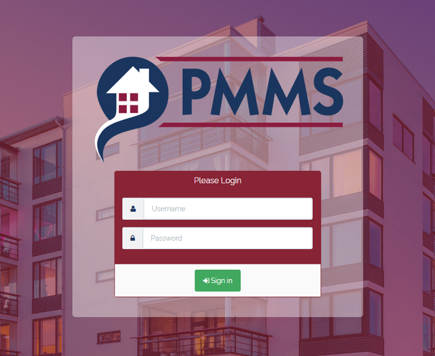

<h1 class="page-header text-center">Property Management System User Guide</h1>
___
## Overview

The **Property Management System** is the main tool used to manage PMMS Ltd.'s client portfolio. It caters for all aspects of Property Management such as:

  

    <ul class="list-unstyled list-info" style="font-size: 1.2em;">
      <li>&fa-home; Client administration </li>
      <li>&fa-wrench; Job allocation</li>
      <li>&fa-puzzle-piece; Contract Management</li>
      <li>&fa-gbp; Service Charge arrears processing</li>
    </ul>
  

  

      <ul class="list-unstyled list-info" style="font-size: 1.2em;">
        <li>&fa-bolt; Issue tracking</li>
        <li> &fa-truck; Supplier administration</li>
        <li>&fa-location-arrow; Site Visit and Meeting scheduling</li>
        <li>&fa-file-o; Invoice Processing</li>
      </ul>
  

  

___
## Contents

 The **Property Management System** is split into 3 main areas:

  

    

    <h3 class="text-center">Management</h3>
<ul class="text-center list-unstyled">
    <li>[Client Administration](../Management/Client)</li>
    <li>[Property Details](../Management/Property)</li>
    <li>[Contacts List](../Management/Contact)</li>
    <li>[Contractor Management](../Management/Supplier)</li>
</ul>

  

  

    

  <h3 class="text-center">Maintenance</h3>
<ul class="text-center list-unstyled">
   <li> [Job Allocation](../Maintenance/Job) </li>
   <li> [Issue Tracking](../Maintenance/Issue) </li>
   <li> [Site Visit Scheduling](../Maintenance/SiteVisit) </li>
</ul>
  

  

  

    

    <h3 class="text-center">Accounts</h3>
    <ul class="text-center list-unstyled">
      <li>[Invoices](#)</li>
    </ul>
  

  

___
## Login

In order to login to the **Property Management System**  a username and password must first be obtained, which should be provided by the system administrator. The application can be accessed at the following url  

 [http://apps.pmms.org.uk/PMMS](http://apps.pmms.org.uk/PMMS)

 This will then present the login screen

 

 Once the correct login details have been entered, click <i class="fa fa-fw fa-sign-in"></i> Sign In and the [User Dashboard](../Common/dashboard) will be presented.

 ___
##Logout

In order to logout of the system:

1. Select the **User Menu** drop-down from the upper-right of the screen
2. Click &fa-sign-out; Logout
3. You will then be redirected to the [Login](#login) screen
